

    

# Beer Recommender System

A beer recommendation system implementing Collaborative Filtering (CF) and Content-Based (CB) pipelines on the BeerAdvocate and RateBeer datasets. The system offers personalised recommendations, cold-start onboarding, real-time feedback updates, and a full React frontend.

&nbsp; 

## Documentation

You can find all the documentation in the following files:

- [Installation Guide](install.md)
- [Project Summary](summary.md)
- [Modules Description](modules.md)

&nbsp; 

## About

This project is developed for the *Recommender Systems Workshop* at Tel Aviv University.  
More information can be found on the [Workshop Website](https://courses.cs.tau.ac.il/recsys/).

### Authors

- Nitzan Zacharia - zacharia1@mail.tau.ac.il
- Inbal Moryles - inbalmoryles@mail.tau.ac.il
- Moran Khoury - morankhoury@mail.tau.ac.il
- Nadav Ravid - nadavravid1@mail.tau.ac.il
- Dudi Benudiz - dudibenudiz@mail.tau.ac.il

&nbsp; 

## Screenshots
### Home Page
The main dashboard after login. Features Rubi's Daily Recommendation hero card plus personalized swimlanes (top picks, adventurous picks, anti-recommendations) generated by the hybrid CF/CB engine.

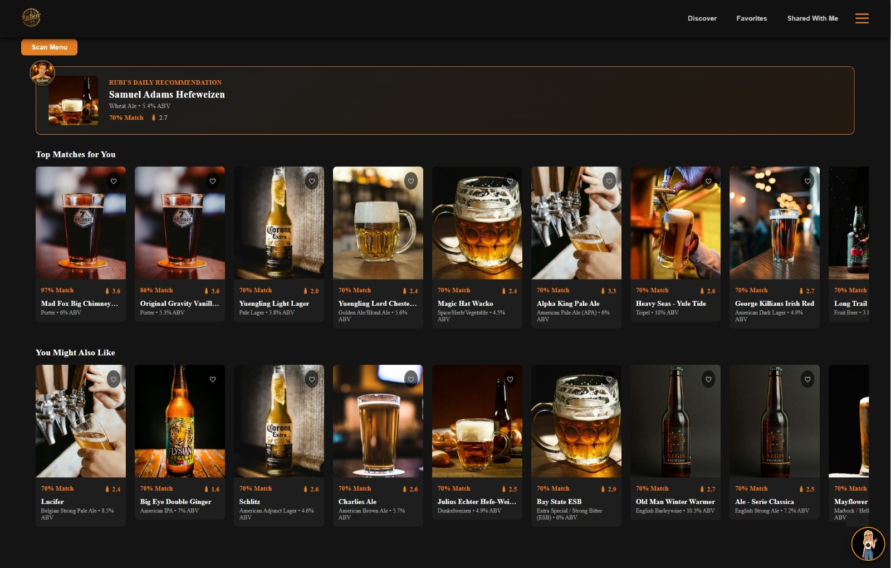

### Beer Card 
The beer detail modal, opened from any card in the app. Shows the personalized match score, lets the user rate and review the beer, surfaces similar beers, and includes the "Share this beer" action.

### Explore
A search-driven catalog browser (`DiscoverPage`) for finding any beer in the dataset by name, independent of personalized recommendations — useful for looking up a specific beer rather than browsing suggestions.

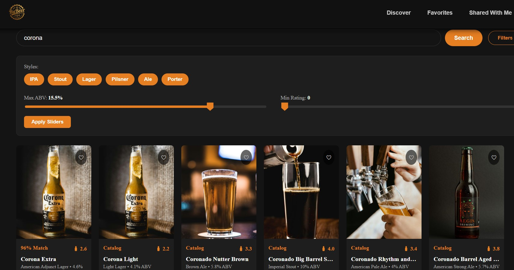

### Build a 6-Pack
Generates curated 6-packs of beer recommendations tailored to your personal taste, or the shared preferences of you and your friends. You can choose exactly how many 6-packs to generate at once, and save them all into named, organized lists for later.

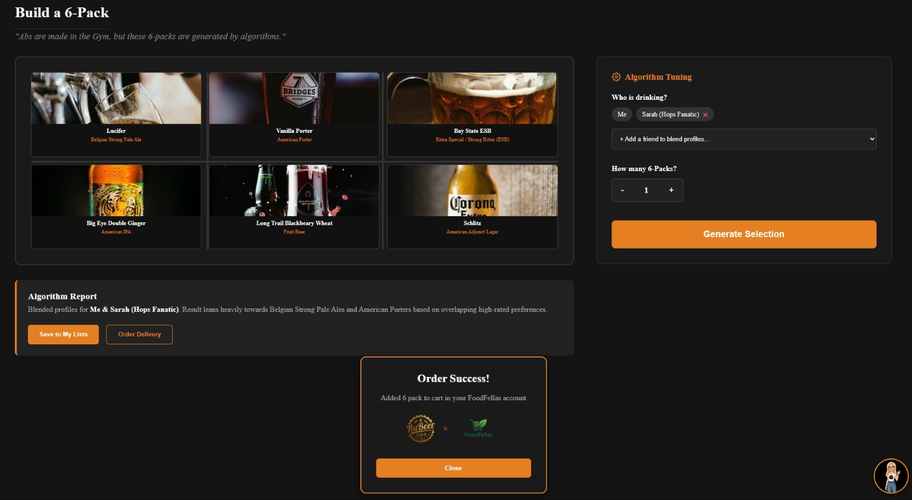

### Share a Beer
From the beer detail modal, a user can send a specific beer, with an optional note, directly to another registered user — it then shows up in that user's "Shared With Me" inbox.

### Beer Lists
User-curated and built in collections of beers, organized into named sections, where beers can be added, browsed, or removed per list.

### Favorites
A quick-access wishlist of beers the user has marked with the favorite icon, for one-click return visits without re-searching.

### Shared With Me
An inbox of beers other users have shared, each with the sender's note, and an unread-count badge in the navbar until viewed.

### User Profile
Account Management: Update your display name and password, track your total ratings, and view your 'RuBeer Rank' based on your rating activity. This section also includes the Friend Compatibility widget (described below).

### Friend Compatibility
Lets the user pick a friend from their profile and computes a compatibility percentage based on beers both users have rated, highlighting shared favorites.

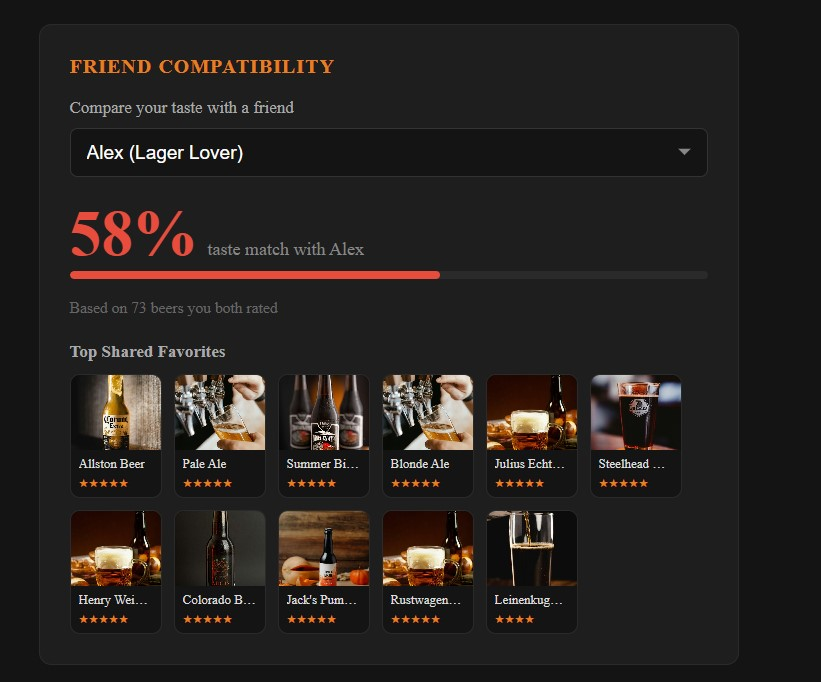

### Rubi's Daily Recommendation
A hero card on the home page spotlighting one standout beer pick per session.

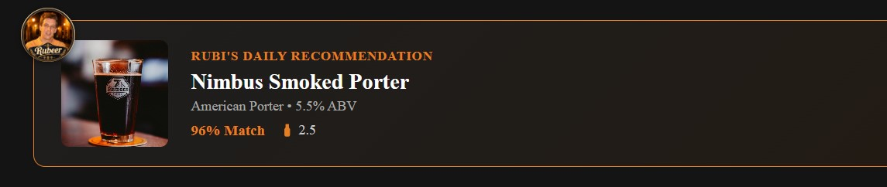

### Feeling Adventurous
A recommendation lane that intentionally surfaces beers outside the user's usual taste profile, encouraging exploration beyond their normal preferences.

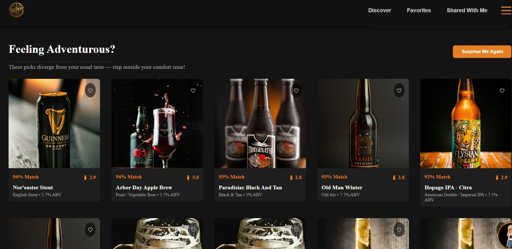

### Anti-Recommender List
The inverse of personalized recommendations — beers the model predicts the user is least likely to enjoy, useful as a "what to avoid" list.

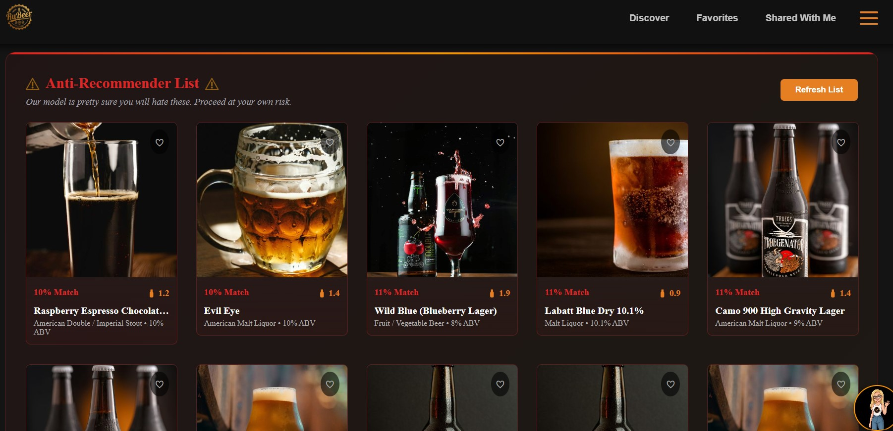

### Top 50 Rated All-Time
A global, non-personalized leaderboard of the highest-rated beers across the entire dataset.

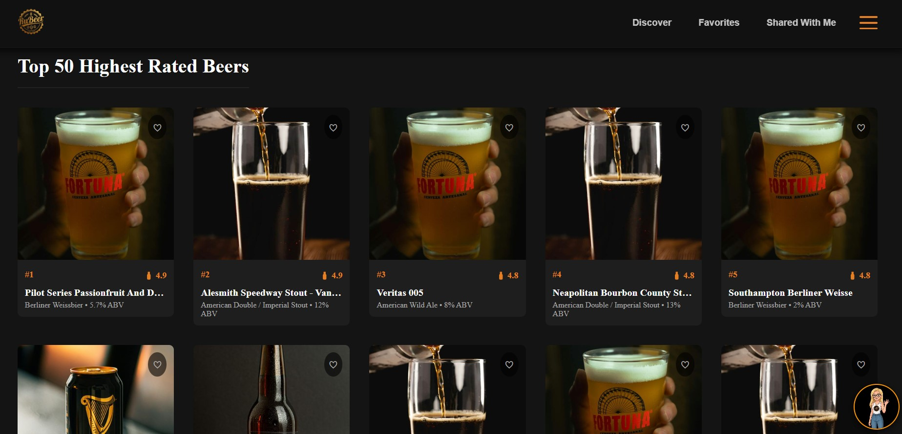

### Scan Menu
Upload a photo of a beer menu; the backend extracts the beer names from the image and returns personalized match scores for whichever of those beers exist in the catalog.

### Stav AI Assistant
A floating AI chat widget, available on every screen once logged in, that answers questions about the app and its beers.

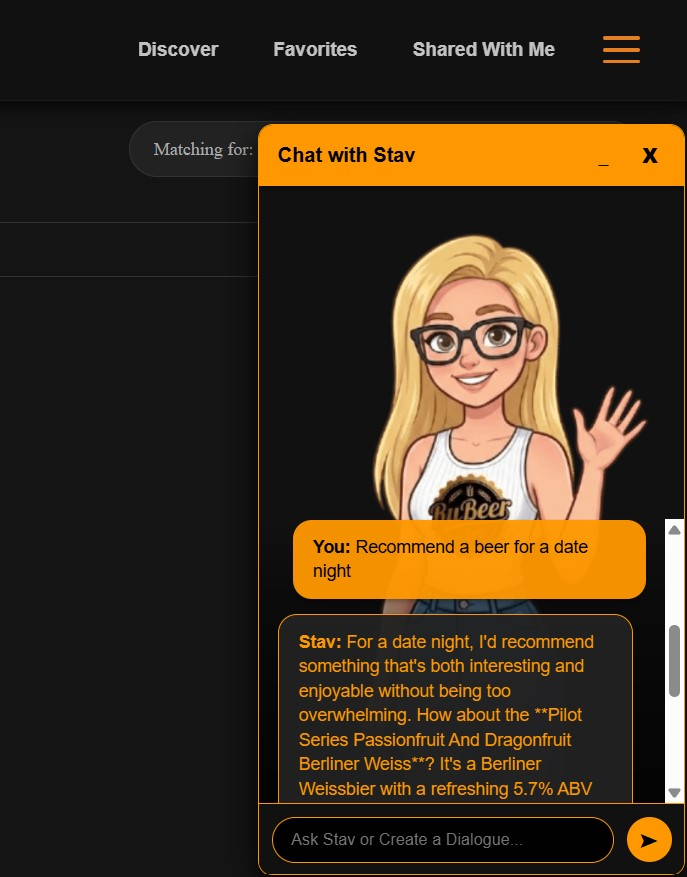

### Cold-Start Onboarding
Shown to first-time users right after signup, before they reach the main dashboard: a choice between two ways to seed their taste profile (Method 1 or Method 2 below), or skipping onboarding entirely.

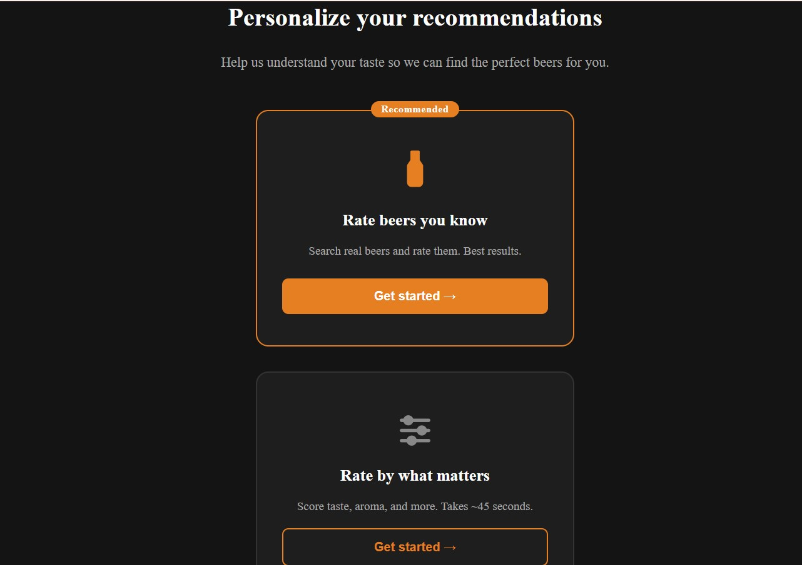

### Cold-Start Onboarding - Method 1
"Rate beers you know" — the user searches for real beers they've had before and rates them directly, seeding both the collaborative-filtering fold-in and content-based profile with real preference data.

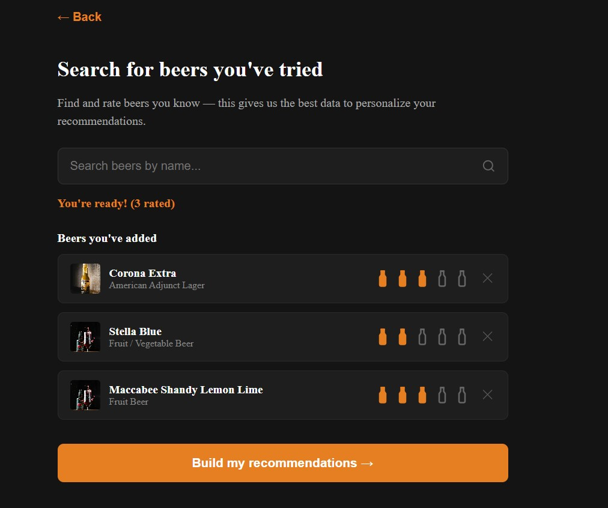

### Cold-Start Onboarding - Method 2
"Rate by what matters" — a ~45-second quiz scoring taste, aroma, appearance, and palate preferences plus favorite styles/ABV range, used to build a content-based taste profile without needing any specific beer ratings.

